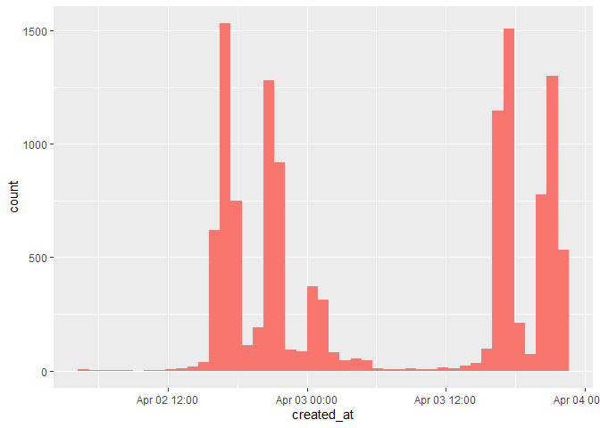

<!-- README.md is generated from README.Rmd. Please edit that file -->
# April 2022 General Conference of the Church of Jesus Christ of Latter-Day saints

<!-- badges: start -->
<!-- badges: end -->

Quick Analysis of The Hash tag \#GeneralConference at the April 2022
General Conference of the Church of Jesus Christ of Latter-Day saints.

This Histogram show the number of tweets along a time line of Conference
weekend.

<!-- -->

This is a sentiment analysis of the tweets that were pulled. All “bars”
below the 0 line are negative. The results show the it is mostly
positive.

<!-- -->
